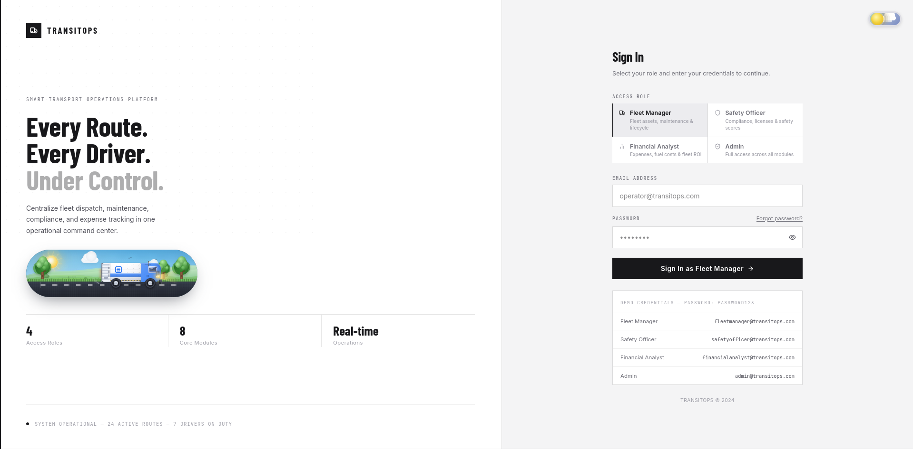
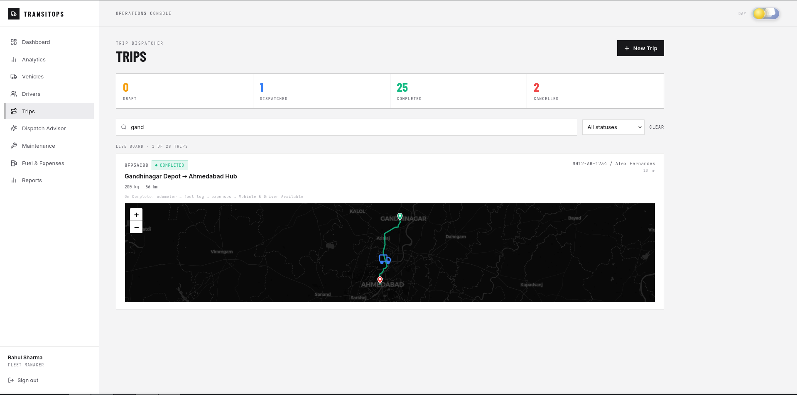
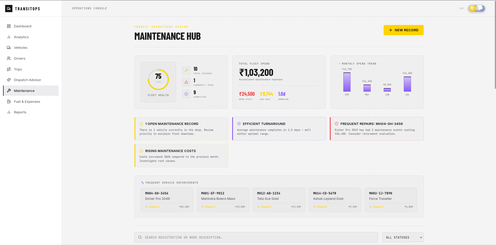
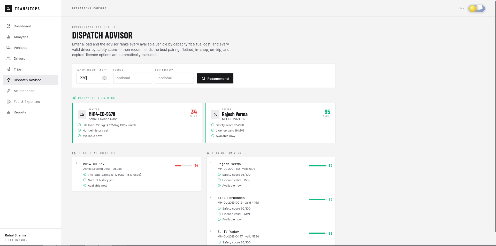
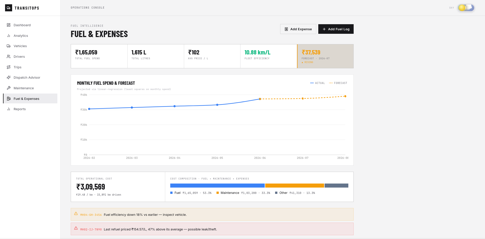
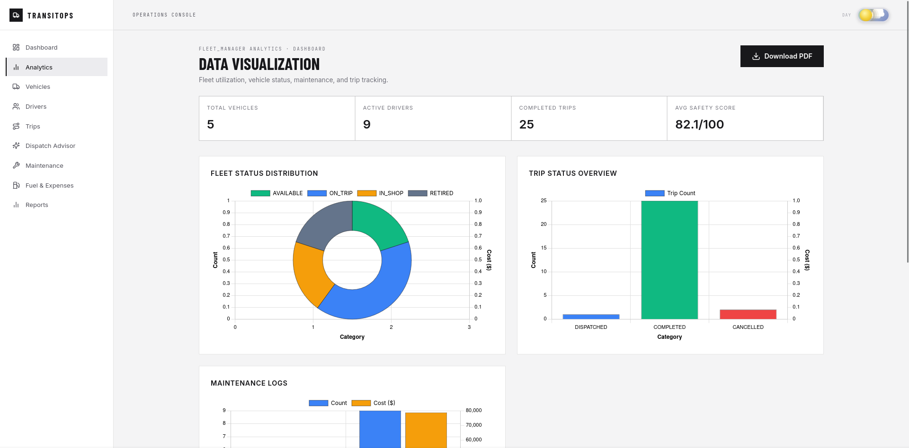

# TransitOps — Smart Transport Operations Platform



TransitOps is a unified fleet management, dispatch coordination, and logistics operations platform. Built for transport coordinators, fleet managers, safety officers, and financial analysts, it provides role-based workspaces to orchestrate vehicle lifecycles, track active trips, monitor maintenance schedules, and analyze financial performance.

---

## Core Capabilities & Workflows

### 1. Operations Dashboard
A live operational command center displaying active/available fleet metrics, real-time utilization rates, trip status counts, and driver duty statuses. The dashboard serves as the central hub for monitoring overall operational throughput.

### 2. Trip Dispatcher & Routing
Coordinates trip scheduling by pairing available vehicles and drivers. Incorporates a dynamic map layer detailing routes from origin to destination with interactive markers.
- **Business Rule**: Dispatching a trip automatically transitions the assigned vehicle and driver status to `ON_TRIP`, excluding them from subsequent dispatch lists until the trip is completed or cancelled.



### 3. Maintenance Hub
Manages vehicle repair cycles, scheduled maintenance, and overall fleet health.
- **Business Rule**: Creating a maintenance record automatically changes the vehicle's status to `IN_SHOP`, preventing trip assignment. Closing the record restores it to `AVAILABLE` (unless `RETIRED`).
- **Analytics**: Calculates a dynamic Fleet Health Score, displays monthly maintenance cost trends, aggregates downtime metrics, and highlights frequently serviced vehicles alongside pattern-based alerts.



### 4. Dispatch Advisor
An AI-driven assistant that analyzes active fleet availability, driver logs, and routes to recommend optimal pairings, reducing dispatch friction and maximizing operational efficiency.



### 5. Fuel & Expense Logging
Tracks fuel consumption and operational costs across the fleet, facilitating real-time calculation of fuel efficiency metrics and total cost of ownership.



### 6. Reports & Role-Based Analytics
Generates specialized analytics dashboards tailored to specific user roles (Admin, Fleet Manager, Safety Officer, Financial Analyst) with on-demand PDF report exporting.



---

## System Architecture

### Technical Stack
- **Frontend**: React (Vite) with a tailwind-compatible custom CSS design system, Lucide icons, and Leaflet Maps.
- **Backend**: Node.js and Express REST API featuring transactional route handlers.
- **Database**: PostgreSQL (NeonDB) featuring structured relational schemas, custom status ENUMs, foreign keys, and indexes on frequently queried columns.
- **Authentication**: Stateless JWT-based authentication with Role-Based Access Control (RBAC).

### Database Schema Overview
The relational schema resides in `backend/schema.sql` and comprises the following primary entities:
- `users`: Core authentication table carrying roles (`ADMIN`, `FLEET_MANAGER`, `SAFETY_OFFICER`, `FINANCIAL_ANALYST`).
- `vehicles`: Fleet registry with status tracking (`AVAILABLE`, `ON_TRIP`, `IN_SHOP`, `RETIRED`).
- `drivers`: Driver licensing, status, and safety records.
- `trips`: Dispatch records mapping vehicles, drivers, origin/destination coordinates, and lifecycle states.
- `maintenance_logs`: Historical and active service records with cost and downtime tracking.
- `fuel_logs` & `expenses`: Financial tracking logs.

---

## Getting Started

### 1. Prerequisites & Environment
Ensure Node.js and PostgreSQL are installed. Create a `.env` file inside the `backend/` folder:

```env
DATABASE_URL=postgresql://<user>:<password>@<host>/<db>?sslmode=require
JWT_SECRET=your_secret_key
PORT=5000
```

### 2. Installation
Install workspace-wide dependencies:
```bash
npm run install:all
```

### 3. Database Migration & Seeding
Apply the schema and seed the database with initial demo data:
```bash
npm run migrate --prefix backend
npm run seed --prefix backend
```

### 4. Running the Project
Launch both the Express backend and Vite frontend concurrently:
```bash
npm run dev:all
```
- Frontend: `http://localhost:5173`
- Backend API: `http://localhost:5000`

---

## Role Permissions & Credentials

Password for all demonstration accounts: **`password123`**

| Role | Email | Permitted Views |
|---|---|---|
| Fleet Manager | `fleetmanager@transitops.com` | Dashboard, Vehicles, Drivers, Trips, Maintenance, Dispatch Advisor |
| Safety Officer | `safetyofficer@transitops.com` | Dashboard, Drivers, Trips, Reports (Safety) |
| Financial Analyst | `financialanalyst@transitops.com` | Dashboard, Trips, Fuel, Reports (Financial) |
| Admin | `admin@transitops.com` | Full system access across all views |
